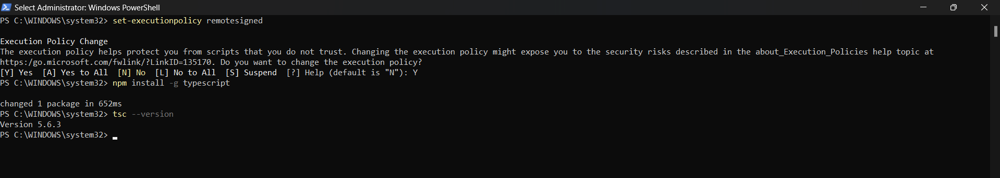
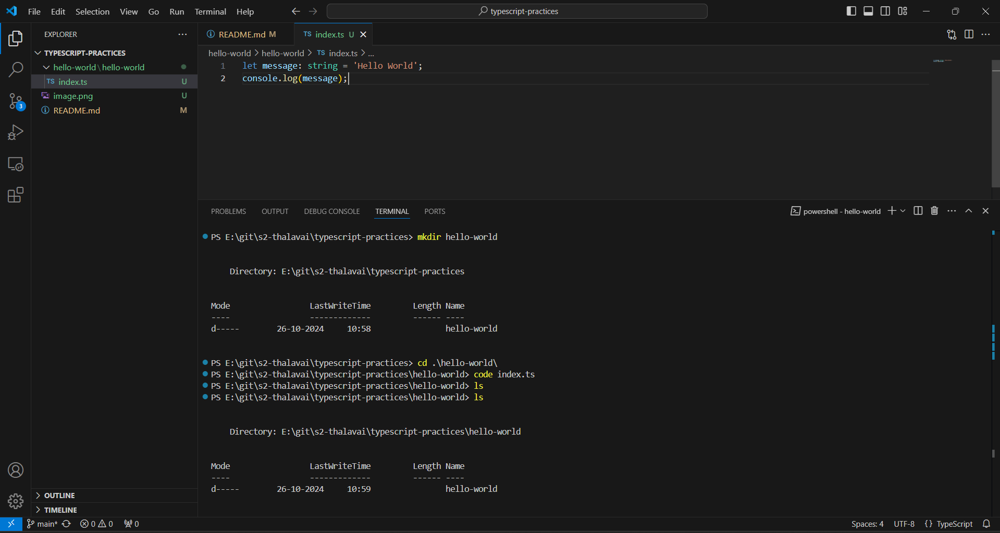
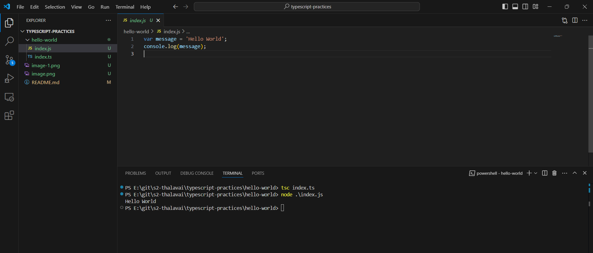

# typescript-practices

## Installing TypeScript

npm install -g typescript

tsc --version

## creating TypeScript project

mkdir hello-world

cd hello-world

code index.ts

## compiling & running TypeScript project

tsc index.ts  

node .\index.js

